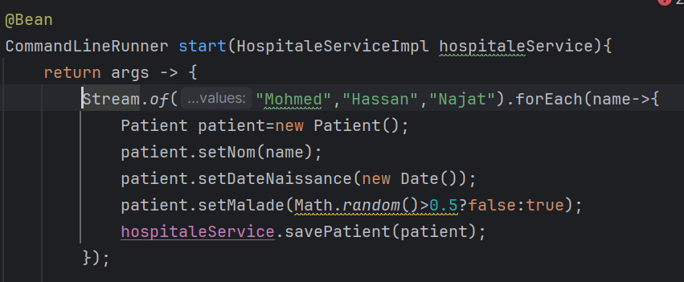
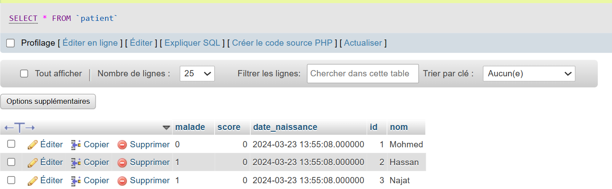
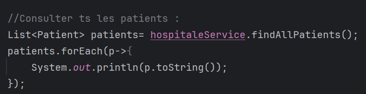
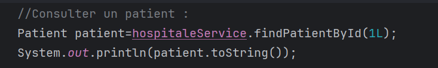
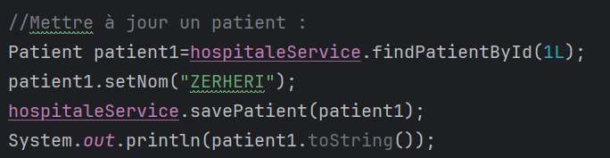
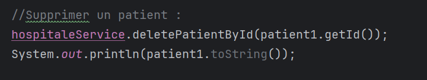

<h1>
Project Patient using ORM, JDBC, JPA Hibernate, Spring data 
</h1>

Ajouter des patients :  

Consulter tous les patients :

Consulter un patient :

 Mettre à jour un patient  :

supprimer un patient :

